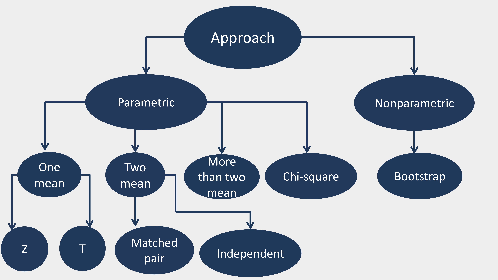
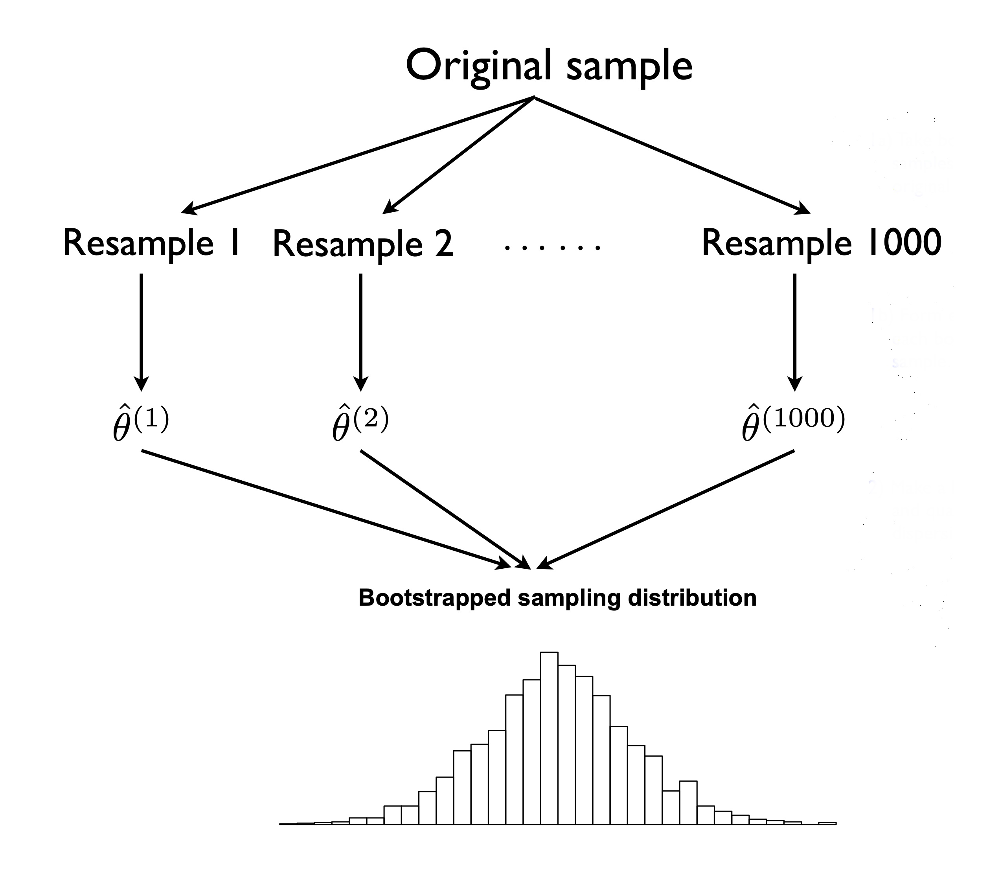
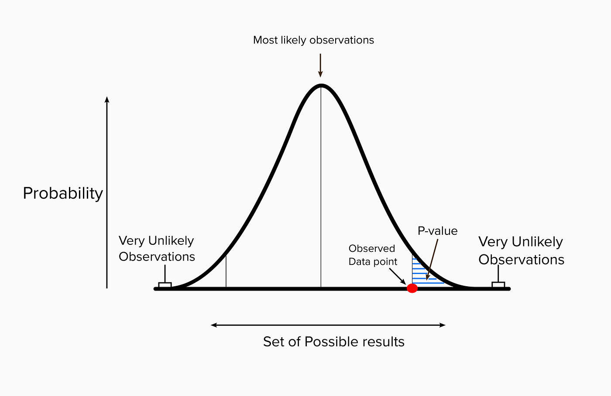

class: center,middle , inverse

```{r setup, include=FALSE}
options(htmltools.dir.version = FALSE)
knitr::opts_chunk$set(
  fig.width=9, fig.height=3.5, fig.retina=3,
  out.width = "100%",
  cache = FALSE,
  echo = TRUE,
  message = FALSE, 
  warning = FALSE,
  hiline = TRUE
)
```

```{r xaringan-themer, include=FALSE, warning=FALSE}
library(xaringanthemer)
style_mono_light(base_color = "#23395b")
```


##Group Members
<i><b>
Fahmida Akter Keya

Kazi Anika Hayder

Shafrin Mardia

Md Omar Faruk

Montasir Affan </b></i>
---

class:center, middle

##Objective

>A function that will  do hypothesis testing and show the test statistic , the p value , confidence interval of the estimate that will  assist the user to draw conclusions according to the input data set.

---
## Hypothesis
- A concept or idea that you test through research and experiments.
<br>
<br>

**Null Hypothesis** ( $H_0$ )

- The null hypothesis is the statement or claim being made about population.(which we are trying to disprove)

**Alternative Hypothesis** ( $H_1$ )

- The hypothesis that we are trying to prove and which is accepted<br> if we have sufficient evidence to reject the null hypothesis.
---
class: center
# Hypothesis
<br><br>
***"The average monthly salary of a garments employee is  more than 7000 taka"***
--
<br><br><br>
 ***"The grades of the students of AST 230 are associated to their performance in R Fest 2024"***
--
<br><br>
###Are these assumptions correct?


---
###Hypothesis Testing
- A form of statistical inference that uses data from a sample to draw conclusions about a population parameter or a population probability.

<b><i>Test can be of two types:</i></b>
<dl>
  <dt><i><b>Parametric</b></i></dt>
  <dd>Parametric tests are those that make assumptions about the parameters of the population distribution from which the sample is drawn.
  <br><br>Example- one mean test , two mean test , analysis of variance test</dd>
  <dt><br><i><b>Non-parametric</b></i></dt>
  <dd> Non-parametric test does not assume anything about the underlying distribution. <br>
<br>Example - bootstrap test</dd>
</dl>
---
### Gist in a Flowchart
<br>
```{r, echo=FALSE, out.width="100%",width = "100%",height = "auto"}

```

---
### One-Sample Test of Means
- Used to determine whether the mean of a single sample is significantly different from a known or hypothesized population mean.

***Hypothesis***
- Null hypothesis:&emsp; &emsp; &emsp; &emsp;&emsp;  $H_0: \mu = \mu_0$
- Alternative hypothesis: &emsp; &emsp; $H_1: \mu \neq \mu_0\quad or\quad \mu < \mu_0\quad or \quad \mu > \mu_0$


***Test Statistic*** 
.pull-left[
When standard deviation is known,
$$ z = \frac{\bar{x} - \mu_0}{\frac{\sigma}{\sqrt{n}}}\quad \sim\quad N(0,1)  $$
]
.pull-right[
When standard deviation is unknown,
$$ t = \frac{\bar{x} - \mu_0}{\frac{S}{\sqrt{n}}}\quad \sim\quad t(df) $$
]
 
---
### Two-Sample Test of Means

####Independent
- Compares the means of two independent samples to assess whether they are significantly different from each other.

***Hypothesis***
- Null hypothesis: &emsp; &emsp; &emsp;&nbsp;&nbsp;   $H_0: \mu_1 = \mu_2$
- Alternative hypothesis: &emsp; $H_1: \mu_1 \neq \mu_2\quad or\quad \mu_1 < \mu_2\quad or \quad \mu_1 > \mu_2$

***Test Statistic***
.pull-left[
When standard deviation is known,
$$z = \frac{\bar{x}_1 - \bar{x}_2}{\sqrt{\frac{\sigma_1^2}{n_1} + \frac{\sigma_2^2}{n_2}}}$$
]
.pull-right[
When standard deviation is unknown,
$$t = \frac{\bar{x}_1 - \bar{x}_2}{\sqrt{\frac{s_1^2}{n_1} + \frac{s_2^2}{n_2}}}$$
]


---
### Two-Sample Test of Means


####Matched Pair
- Assesses whether the mean of the differences between paired observations is significantly different from zero. Commonly used for pre- and post-treatment comparisons.

***Hypothesis***
- Null hypothesis:&emsp;&emsp; &emsp; &emsp;&emsp;   $H_0: \mu_d = 0$
- Alternative hypothesis:&emsp; &emsp;  $H_1: \mu_d \neq 0\quad or\quad  \mu_d < 0\quad or \quad \mu_d > 0$

***Test Statistic***
.pull-left[
When standard deviation is known,
$$z = \frac{\bar{d}}{\frac{\sigma_d}{\sqrt{n}}} $$
]
.pull-right[
When standard deviation is unknown,
$$t = \frac{\bar{d}}{\frac{S_d}{\sqrt{n}}} $$
]


---
### More Than Two Means Test
- Used to compare means across more than two groups to determine if there are significant differences.


***Hypothesis***
- Null hypothesis:&emsp;&emsp;&emsp;&emsp;&emsp; $H_0:\mu_1 = \mu_2 = \quad. ..\quad=\mu_n$
- Alternative hypothesis:&emsp;&emsp; $H_1: \mu_i \ne \mu_j ; for\quad at\quad least \quad one\quad pair$

***Test Statistic***
 $$F_0= \frac{MS_{treatment}}{MS_{error}}\quad \sim\quad F(d_1,d_2)$$
 
 ***Assumptions***
- The responses for each factor level have a normal population distribution.
- These distributions have the same variance.
- The data are independent.
<br>
---
### Pearson's Chi-Square Test
- Examines the association between two categorical variables in a contingency table.

***Hypothesis***
- Null hypothesis: $H_0: \quad  There\quad is\quad  no\quad  association\quad between \quad two \quad groups$
- Alternative hypothesis: $H_1: \quad  There\quad is\quad  association\quad between \quad two \quad groups$


***Test Statistic***
$$\chi^2 =  \sum\frac{(Observed_i-Expected_i)^2}{Expected_i}\quad \sim\quad \chi^2(k)$$

***Assumptions***

- The data in the cells should be frequencies, or counts of cases.
- There are 2 variables, and both are measured as categories, usually at the nominal level. However, data may be ordinal, interval or ratio data that have been collapsed into ordinal categories.

---
### Bootstrap Test 
- Bootstrapping is any test or metric that uses random sampling with replacement, and falls under the broader class of resampling methods. Bootstrapping assigns measures of accuracy to sample estimates. This technique allows estimation of the sampling distribution of almost any statistic using random sampling methods.

***Hypothesis***
- Null hypothesis:&emsp;&emsp;&emsp; $$H_0: \quad  There\quad is\quad  no\quad  significant\quad difference$$
- Alternative hypothesis:&emsp;&emsp; $$H_1: \quad  There\quad is\quad significant\quad difference$$


***Test Statistic***

$$Mean \quad difference \quad of \quad two \quad groups $$
---
### Bootstrap Test 
***Algorithm***

- Choose a number of bootstrap samples.

- For each bootstrap sample, draw a sample with replacement with the given sample size.

- Calculate the test statistic of the given sample and every bootstrapped samples.

- Finding the proportion of test statistic of bootstrapped samples that were greater or equal to the given sample's test statistic.

- Inspect the p-value and draw conclusion thereby.

---
### Bootstrap Test 
<center>  </center>

---
<br>
### P-value
> The p-value is the probability of obtaining results at least as extreme as the observed results of a statistical hypothesis test, assuming that the null hypothesis is correct. 

$$p - value = \quad P(E/H_0) $$
--

### Confidence Interval

>A confidence interval refers to the probability (often 95% is used) that a population parameter will fall between a set of values for a certain proportion of times.

$$CI \quad= \bar{x} \quad\pm  \quad z \frac{\sigma}{\sqrt{n}}$$
---
##Interpreting P-value


<center></center>

Under the null the hypothesis if - <br> <br>
- P value > alpha  :  we fail to reject the null hypothesis.  <br>
- P value < alpha  : we may reject the null hypothesis.


---
class: center, middle, inverse

## Function 
---
class: center, middle
```{r ,echo=FALSE}
  library(tidyverse)

test_of_hypothesis<-function(approach,independent=NULL,x,y=NULL,mu_0=NULL,sigma_x=NULL,
                             sigma_y=NULL,sigma_d=NULL,n1=NULL,n2=NULL,B=NULL,alpha,H1){
 
  if(approach == "parametric"){
   
   
   
    if( is.vector(x) & !is.character(x) & !is.null(mu_0)){
     
      mu=mean(x)
      n=length(x)
     
     
      if(!is.null(sigma_x) & n>30){
       
        z_cal=round(((mu-mu_0)*sqrt(n))/sigma_x,3)
        z_tab<-qnorm(alpha,0,1,F)
        z_tab2<-qnorm(alpha/2,0,1,F)
       
       
        b<-function(H1){
          if(H1=="mu>mu_0"){
            p=round(pnorm(z_cal,lower.tail = F),3)
            lo=NULL
            up=round(mu+((z_tab*sigma)/sqrt(n)),3)
           
          }
          else if(H1=="mu<mu_0"){
            p=round(pnorm(z_cal,lower.tail = T),3)
            lo=round(mu-((z_tab*sigma)/sqrt(n)),3)
            up=NULL
           
           
          }
          else if(H1== "mu!=mu_0"){
            p=round(2*(1-pnorm(abs(z_cal))),3)
            lo=round(mu-((z_tab2*sigma)/sqrt(n)),3)
            up=round(mu+((z_tab2*sigma)/sqrt(n)),3)
           
           
          }
          H0<-"mu=mu_0"
         
         
          return(tibble(p_value=p,Test_statistics=z_cal,lower_bound=lo,upper_bound=up ,H1=H1))
        }
      }
      else if(n<30){
        s=sqrt((sum((x-mu)^2))/(n-1))
       
        t_cal=round(((mu-mu_0)*sqrt(n))/s,3)
        t_tab<-qt((alpha),(n-1),lower.tail = F)
        t_tab_2<-qt((alpha/2),(n-1),lower.tail = F)
       
        b<-function(H1){
          if(H1=="mu>mu_0"){
            p=round(pt(t_cal,(n-1),lower.tail = F),3)
            lo=NULL
            up=round(mu+((t_tab*s)/sqrt(n)),3)
           
           
          }
          else if(H1=="mu<mu_0"){
            p=round(pt(t_cal,(n-1),lower.tail = T),3)
            lo=round(mu-((t_tab*s)/sqrt(n)),3)
            up=NULL
           
           
          }
          else if(H1== "mu!=mu_0"){
            p=round(2*pt(-abs(t_cal),(n-1)),3)
            lo=round(mu-((t_tab_2*s)/sqrt(n)),3)
            up=round(mu+((t_tab_2*s)/sqrt(n)),3)
           
           
          }
          H0<-"mu=mu_0"
          df<-n-1
          return(tibble(p_value=p,Test_statistics=t_cal,degrees_of_freedom=df,lower_bound=lo,upper_bound=up,H1=H1))
        }
      }
      return(b(H1))
     
    }
   
   
    if(!is.null(independent)  &  !is.null(y)){
     
      n=length(x)
      m=length(y)
     
     
      if(independent == "TRUE" ){
       
        if( !is.null(sigma_x) & !is.null(sigma_y) & n>30 & m>30){
         
          xbar <- mean(x)
          ybar <- mean(y)
         
          co<-sqrt(((sigma_x)^2/n)+((sigma_y)^2/m))
          z_cal<-round((xbar-ybar)/co,3)
         
          z_tab<-qnorm(alpha,0,1,F)
          z_tab2<-qnorm(alpha/2,0,1,F)
         
         
          b<-function(H1){
            if(H1=="mu>mu_0"){
              p=round(pnorm(z_cal,lower.tail = F),3)
              lo=NULL
              up=round((xbar-ybar)+(z_tab*co),3)
             
            }
            else if(H1=="mu<mu_0"){
              p=round(pnorm(z_cal,lower.tail = T),3)
              lo=round((xbar-ybar)-(z_tab*co),3)
              up=NULL
             
             
            }
            else if(H1== "mu!=mu_0"){
              p=round(2*(1-pnorm(abs(z_cal))),3)
              lo=round((xbar-ybar)-(z_tab2*co),3)
              up=round((xbar-ybar)+(z_tab2*co),3)
             
             
            }
            H0<-"mu=mu_0"
           
           
            return(tibble(p_value=p,Test_statistics=z_cal,lower_bound=lo,upper_bound=up,H1=H1))
          }
         
         
        }
        if( is.null(sigma_x) & is.null(sigma_y) & n<30 & m<30){
         
          xbar <- mean(x)
          ybar <- mean(y)
         
          sx <- sd(x)
          sy <- sd(y)
          sp <- sqrt(((n-1)*sx^2+(m-1)*sy^2)/(n+m-2))
          t_cal <- round((xbar - ybar) / sp*(sqrt(1/n+1/m)),3)
          t_tab <-qt(alpha, (n+m-2),lower.tail = F)
          t_tab2 <- qt((alpha/2), (n+m-2),lower.tail = F)
         
         
          b<-function(H1){
            if(H1=="mu>mu_0"){
              p=round(pt(t_cal,(n+m-2),lower.tail = F),3)
              lo=NULL
              up=round((xbar-ybar)+(t_tab*sp*(sqrt(1/n+1/m))),3)
             
             
            }
            else if(H1=="mu<mu_0"){
              p=round(pt(t_cal,(n+m-2),lower.tail = T),3)
              lo=round((xbar-ybar)-(t_tab*sp*(sqrt(1/n+1/m))),3)
              up=NULL
             
             
            }
            else if(H1== "mu!=mu_0"){
              p=round(2*pt(-abs(t_cal),(n+m-2)),3)
              lo=round((xbar-ybar)-(t_tab2*sp*(sqrt(1/n+1/m))),3)
              up=round((xbar-ybar)+(t_tab2*sp*(sqrt(1/n+1/m))),3)
             
             
            }
            H0<-"mu=mu_0"
            df<-n+m-2
            return(tibble(p_value=p,Test_statistics=t_cal,degrees_of_freedom=df,lower_bound=lo,upper_bound=up,H1=H1))
          }
        }
       
      }
     
      else if(independent == "FALSE")
      {
       
        if( !is.null(sigma_d) & n>30 & m>30){
         
          differences <- (y -x)
          r <- length(differences)
         
          mean_diff <- mean(differences)
         
          co<-sqrt(((sigma_d)^2)/r)
          z_cal<-round(mean_diff/co,3)
         
          z_tab<-qnorm(alpha,0,1,F)
          z_tab2<-qnorm((alpha/2),0,1,F)
         
         
          b<-function(H1){
            if(H1=="mu>mu_0"){
              p=round(pnorm(z_cal,lower.tail = F),3)
              lo=NULL
              up=round(mean_diff+((z_tab*sigma_d)/sqrt(r)),3)
             
            }
            else if(H1=="mu<mu_0"){
              p=round(pnorm(z_cal,lower.tail = T),3)
              lo=round(mean_diff-((z_tab*sigma_d)/sqrt(r)),3)
              up=NULL
             
             
            }
            else if(H1== "mu!=mu_0"){
              p=round(2*(1-pnorm(abs(z_cal))),3)
              lo=round(mean_diff-((z_tab2*sigma_d)/sqrt(r)),3)
              up=round(mean_diff+((z_tab*sigma_d)/sqrt(r)),3)
             
             
            }
            H0<-"mu=mu_0"
           
           
            return(tibble(p_value=p,Test_statistics=z_cal,lower_bound=lo,upper_bound=up ,H1=H1))
          }
         
         
        }
       
        if( is.null(sigma_d) & n<30 & m<30){
         
         
          differences <- (y -x)
          r <- length(differences)
         
          mean_diff <- mean(differences)
          sd_diff <- sqrt(sum((differences - mean_diff)^2) / (r - 1))
         
          t_cal <- round(mean_diff / (sd_diff / sqrt(r)),3)
         
          df <- r- 1
         
          t_tab <-qt(alpha, df,lower.tail = F)
          t_tab2 <- qt((alpha/2),df,lower.tail = F)
         
         
          b<-function(H1){
            if(H1=="mu>mu_0"){
              p=round(pt(t_cal,df,lower.tail = F),3)
              lo=NULL
              up=round(mean_diff+((t_tab*sd_diff)/sqrt(r)),3)
             
             
            }
            else if(H1=="mu<mu_0"){
              p=round(pt(t_cal,df,lower.tail = T),3)
              lo=round(mean_diff-((t_tab*sd_diff)/sqrt(r)),3)
              up=NULL
             
             
            }
            else if(H1== "mu!=mu_0"){
              p=round(2*pt(-abs(t_cal),df),3)
              lo=round(mean_diff-((t_tab2*sd_diff)/sqrt(r)),3)
              up=round(mean_diff+((t_tab2*sd_diff)/sqrt(r)),3)
             
             
            }
            H0<-"mu=mu_0"
           
            return(tibble(p_value=p,Test_statistics=t_cal,degrees_of_freedom=df,lower_bound=lo,upper_bound=up,H1=H1))
          }
         
        }
       
      }
     
      return(b(H1))
     
    }
   
   
    if(is.character(x) & !is.null(y) & !is.null(n1) & !is.null(n2)){
     
     
     
      datt <- data.frame(x,y )
     
      N <- n1*n2
     
      constant <- sum(y)^2 / N
     
      sst <- sum(y^2) - constant
     
      yi. <- sapply(split(y,x), sum )
      sstreat <- (sum(yi.^2)/n2) - constant
     
      sse <- sst - sstreat
     
      mstreat <- sstreat / (n1-1)
      mse <- sse / (N-n1)
     
      f_cal <- round(mstreat / mse,3)
     
      f_tab <- qf((alpha), n1-1, N-n1, lower.tail = F)
     
     
     
      H0 <- "Treatment means are equal"
     
      pvalue <-round(pf(f_cal,n1-1, N-n1,lower.tail = F),3)
      t_tab<-qt((alpha/2),(N-n1),lower.tail = F)
      t_tab
      val<-t_tab*(sqrt(mse/n2))
      val
      a<-datt %>%
        group_by(x) %>%
        reframe(CI_lower=(mean(y)-val),CI_upper=(mean(y)+val))
      df1<-n1-1
      df2<-N-n1
     
     
     
      return(data.frame(p_value=pvalue,test_statistic =  f_cal,df1=df1,df2=df2,a,H1=H1))
    }
   
   
    if(is.matrix(x) & !is.null(n1)  & !is.null(n2)){
     
     
     
      df=(n1-1)*(n2-1)
     
     
     
      a<-NULL
      b<-NULL
      for(i in 1:n1){
        a[i]<-sum(x[i,])
      }
     
      for(j in 1:n2){
        b[j]<-sum(x[,j])
      }
     
     
      eij <- matrix(0, nrow = n1, ncol = n2)
      for(i in 1:n1){
        for(j in 1:n2){
          eij[i,j]<-a[i]*b[j]/sum(x)
        }
      }
     
      q<-0
     
      for(i in 1:n1){
        for(j in 1:n2){
          q=q+sum((x[i,j]-eij[i,j])^2/eij[i,j])
        }
      }
      r<-round(q,3)
      pvalue<-round(pchisq(q,df,lower.tail = F),3)
     
      H0<-"No association"
     
     
      return(data.frame(p_value=pvalue,Test_statistic=r,degrees_of_freedom=df,H1=H1))
     
    }
  }
 
 
 
  if(approach == "non_parametric"){
   
    if( !is.null(y) & !is.null(B)){
     
     
      m1<-mean(x)
      m2<-mean(y)
      m<-c(x,y)
     
      n1<-length(x)
      n2<-length(y)
      test_stat<-abs(m1-m2)
      dif<-rep(NA,B)
     
      for(i in 1:B){
        groupA<- sample(m,n1,T)
        groupB<- sample(m,n2,T)
        dif[i]<-abs(mean(groupA)-mean(groupB))
       
      }
     
      p_val = (sum(dif>= test_stat))/B
     
      H0<-"There is no treatment effect"
     
      return(data.frame(p_val=p_val,test_statistic=test_stat,H1=H1))
     
    }
  }
 
}

```


## The Function

```{r, eval=FALSE}
test_of_hypothesis <- 
  function(approach,independent=NULL,x,y=NULL,mu_0=NULL,sigma_x=NULL,
           sigma_y=NULL,sigma_d=NULL,n1=NULL,n2=NULL,B=NULL,alpha,H1)
```
---
###Description
```{r , echo=FALSE, eval=TRUE}
Arguments <- c("approach","independent", "x", "y", "mu_0", "sigma_x","sigma_y","sigma_d", "n1", "n2", "B", "alpha", "H1")
Identities <- c("parametric or non-parametric","True or False", "sample data", "sample data", "hypothesized mean", "population standard deviation of x", "population standard deviation of y","population standard deviation of paired differences","number of rows/level of treatment", "number of columns/number of observations", "number of replication", "level of significance", "alternate hypothesis")

df <- data.frame(Arguments, Identities)

knitr::kable(df, format = 'html')
```

---

##Uses:

### One-Sample Test of Means: Z test
```{css, echo=FALSE}
pre code {
  white-space: pre-wrap;
}
```

```{r, echo=FALSE}
knitr::opts_chunk$set(tidy.opts = list(width.cutoff = 60), tidy = TRUE)
```


```{r,  echo = TRUE, eval=TRUE}

x <- rnorm(50, mean = 3.5, sd = 1.7)
sigma <-  1
mu_0 <-  3
alpha <- 0.05
H1 <- "mu>mu_0"

```

```{r, comment= NA }
test_of_hypothesis(approach = "parametric", x = x,sigma_x = sigma, 
                   mu_0 = mu_0, alpha = alpha, H1 = H1 )
```

---

### One-Sample Test of Means: T test
```{r,  echo = TRUE, eval=TRUE}

x <- rnorm(20, mean = 3.5, sd = 1.7)
mu_0 <-  3
alpha <- 0.05
H1 <- "mu>mu_0"
```

```{r, comment= NA}
test_of_hypothesis(approach = "parametric", x = x, 
                   mu_0 = mu_0, alpha = alpha, H1 = H1 )
```


---

### Two-Sample Test of Means( Independent ): T test

```{r,  echo = TRUE, eval=TRUE}

x <- rnorm(20, mean = 3.5, sd = 1.7)
y <- rnorm(20, mean = 5.4, sd = 2.6)
alpha <- 0.05
H1 <- "mu>mu_0"

```

```{r , comment= NA}
test_of_hypothesis(approach = "parametric", independent = TRUE, x = x,
                   y = y, alpha = alpha, H1 = H1 )
```

---
### Two-Sample Test of Means( Matched Paired): T Test

```{r,  echo = TRUE, eval=TRUE}

x <- rnorm(20, mean = 3.5, sd = 1.7)
y <- rnorm(20, mean = 5.4, sd = 2.6)
alpha <- 0.05
H1 <- "mu>mu_0"

```

```{r , comment= NA}
test_of_hypothesis(approach = "parametric", independent = FALSE, x = x,
                   y = y, alpha = alpha, H1 = H1 )
```

---
### More Than Two Means Test
```{r}
y <- c(22,42,44,52,45,37,52,33,8,47,43,32,16,24,19,18,34,39)
x <- rep(c("A", "B", "C"), each = 6)
n1 <- 3
n2 <- 6
alpha <- 0.05
H1 <-  "means differ"

```

```{r , comment= NA}
test_of_hypothesis(approach = "parametric", x = x,
                   y = y, n1 = n1, n2 =n2, alpha = alpha, H1 = H1 )

```

---
### Pearson's Chi-Square Test
```{r}
x<-matrix(c(8,4,13,9,16,14,10,16,3,7),2,5)
n1 <- 2
n2 <- 5
```

```{r, comment= NA}
test_of_hypothesis(approach = "parametric",x = x,n1 = n1,n2 = n2,
                   alpha = 0.05, H1="There is association")
```

---
 

### Bootstrap Test 

```{r}
x<-rnorm(12,10,1)
y<-rnorm(1000,20,51)
B<-1000
```

```{r,comment= NA}
test_of_hypothesis (approach = "non_parametric",x = x, y = y, B = B,
                    alpha =0.05, H1 =" Treatment effect exists ")
```
---

class: center, middle, inverse

##Thank you 


